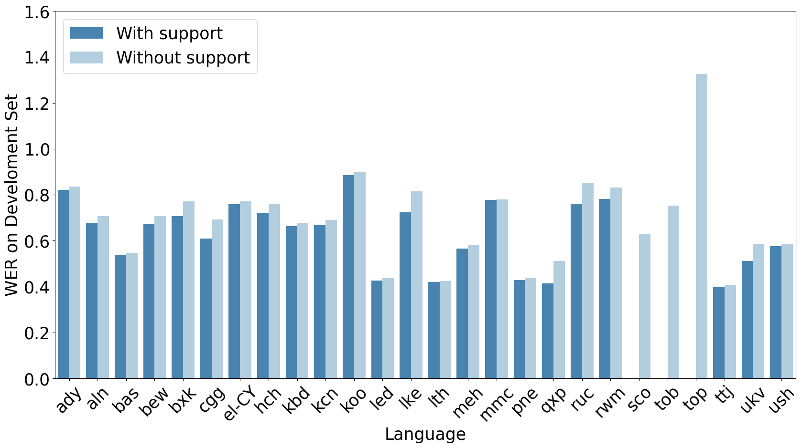

# Georgetown Submission to the Mozilla Shared Task on Spontaneous Speech
This is the code for the Georgetown Submission to the [Mozilla Shared Task on Spontaneous Speech](https://community.mozilladatacollective.com/shared-task-mozilla-common-voice-spontaneous-speech-asr/)

We use LoRA layers and task vectors to perform task arithmetic on the target models in order to incoporate information from genetically related langauges into the final models to bolster ASR performance. We find that this consistently improves performance as seen in whisper-tiny below:



## Getting data

NOTE: You must download Mozilla Common Voice data yourself, as it is not to be redistributed.

```python

from get_data import get_data

data = get_data(split='train', langs=None) # all training data

data = get_data(split='dev', langs='el-CY') # dev data for Cypriot Greek

data[:5]['meta'] # metadata for first 6 rows (pd.DataFrame)
data[0]['audios'] # absolute path to first audio (list[str])
data[7:10]['transcriptions'] # transcriptions of rows 7-10 (list[str])
```

By default, rows with empty transcriptions are filtered out.

Use `log=True` to get messages about rows being filtered.

There is additionally a `show_sample.py` script which will show sampled transcripts for each languge. It takes the argument `-k` which expects a positive integer, the number of samples to show per language.

## Trainer

Language mappings and hyperparameters are set in `config.json`. Set the base model to either `openai/whisper-tiny` or `openai/whisper-large-v3`. To train the high resource languages set `train_high_resource` to `True`. The `proxy_langs` are the languages that Whisper is trained on that are the starting points for our training processes. 

Slurm script for HPC: 
```bash
sbatch scripts/slurm/train.sh
```

run locally using `scripts/trainer.py`

## Evaluation
This script expects models in a folder called `output_whisper-<tiny|large-v3>` and each model to be in a folder named with its language code (e.g. `el-CY`), and for the final model to be in a folder called `final`.
Set `whisper-model` and `lora` in `config.json` values as necessary.

Slurm script for HPC: 
```bash
sbatch scripts/slurm/eval.sh
```

run locally using `scripts/eval.py`

## Test Script
This script expects test data as released by the task: audio files in `mdc_asr_shared_task_test_data/audios/` and all the language tsvs can be found in `mdc_asr_shared_task_test_data/small-model`. Because we end up using our small model for most of our submissions (all except `bew`, `sco`, and `top`), we generate all these and copy into the submission folders where relevant. it will create the test tsvs in a folder called `test_whisper-tiny`. As with all the other scripts set `whisper-model` and `lora` in `config.json` values as necessary.

Slurm script for HPC: 
```bash
sbatch scripts/slurm/test.sh
```

## Results Exploration
We include the notebooks we used for analyzing the final data and generating the images for our paper. However they would need to be modified to point to any results generated from the `eval.py` script in order to be used on new inferences.

run locally using `scripts/produce_test_transcripts.py`
## Authors
[Dan DeGenaro](mailto:drd92@georgetown.edu)
[Emma Rafkin](mailto:epr41@georgetown.edu)
[Xiulin Yang](mailto:xy236@georgetown.edu)